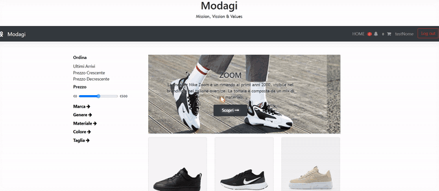

# Modagi

[](https://github.com/davidcohenDC/modagi/actions/workflows/build.yml)
[](https://github.com/davidcohenDC/modagi/releases/latest)
[](LICENSE)

A sneaker shop written in plain PHP, MySQL, jQuery and Bootstrap — no
frameworks, no build step. We built it in a team of three for the Web
Technologies course at the University of Bologna (2020–2022).

I keep it here exactly as we handed it in. The only thing added since is a
way to run it anywhere with one command.

<p align="center">
  
</p>

## What it does

- Catalogue with filters (brand, gender, material, colour, size, price),
  sorting and pagination.
- Cart kept in a cookie, so it survives without an account; checkout with a
  simulated card payment.
- Customer area: order history, profile and password changes, notifications.
- Vendor area: add products and sizes, run promotions, move orders through
  their states.

## Run it

You need Docker. Then:

```sh
git clone https://github.com/davidcohenDC/modagi.git
cd modagi
docker compose up --build
```

Open <http://localhost:8080>. The database is created and filled with demo
data on first start.

| Role     | E-mail           | Password        |
|----------|------------------|-----------------|
| Customer | `test@gmail.com` | `test`          |
| Vendor   | `dev@gmail.com`  | `davidcohen`    |

Each [release](https://github.com/davidcohenDC/modagi/releases/latest)
also carries a zip of the sources: unzip it and run the same
`docker compose up --build`.

## How it is organised

- `index.php`, `product.php`, `cart.php`, `checkout.php`, … — one entry point
  per page, each filling `$templateParams` and including `templates/base.php`.
- `templates/` — the HTML, split into pages, forms and modals.
- `DB/` — a small `Database` wrapper around `mysqli` prepared statements and
  one class per table; `DB/Info/` holds the schema and the demo data.
- `utilis/` — cart, orders, users, notifications, pagination and the fake bank.
- `ajaxFunction/` + `js/` — the cart updates without reloading the page.

## The team

David Cohen, Lorenzo Morelli, Luigi Olivieri.

## Since 2022

The PHP code is untouched. In 2026 I moved the repository here from Bitbucket,
added a Dockerfile and a compose file (with the database configuration read
from environment variables, defaulting to the old local setup), a CI that
lints every file and runs a smoke test against the running site, and
semantic-release to publish it.

## License

[MIT](LICENSE) © 2022 David Cohen, Lorenzo Morelli, Luigi Olivieri
